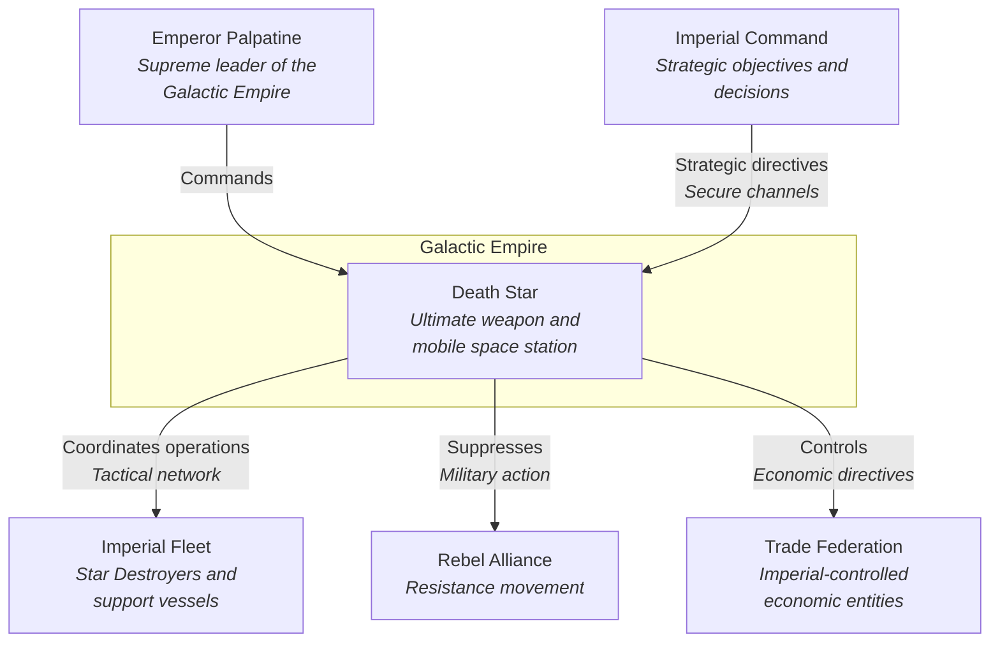
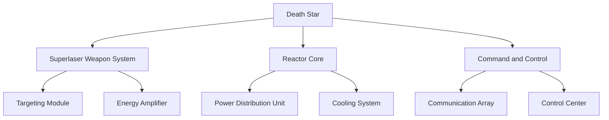

# _Name des Tools/der Komponente_

_Dies ist eine textuelle und leicht angepasste Repräsentation des Architecture Communication Canvas (ACC) gemäß https://canvas.arc42.org/architecture-communication-canvas. Ziel des ACC ist eine möglichst knappe Dokumentation zentraler Aspekte des Tools/der Komponente. Ziel der texttuellen Repräsentation ist eine einfache Darstellung in Markdown und ähnlichen Text-fokussierten Systemen._

_Verwendung der Vorlage:_
* _Ersetze alle kursiv gesetzten Textbausteine entsprechend des Tools/der Komponente, die dokumentiert werden soll. Wenn du fertig bist soll es keine kursiven Textbausteine mehr geben (außer du hast selbst welche hinzugefügt, was total in Ordung wäre)._
* _Ziel ist eine **möglichst knappe** Dokumentation zentraler Aspekte des Tools/der Komponente, die sonst häufig nicht aufgeschrieben werden und in Vergessenheit geraten._

## Inhaltsverzeichnis

* [Metadaten](#metadaten)
* [Zielsetzung](#zielsetzung)
    * [Kundenwert / Geschäftszweck](#kundenwert--geschäftszweck)
    * [Wichtigste Stakeholder](#wichtigste-stakeholder)
    * [Kernfunktionen](#kernfunktionen)
    * [Qualitätsanforderungen](#qualitätsanforderungen)
    * [Business Context](#business-context)
* [Lösung](#lösung)
    * [Kern-Entscheidungen (gute und schlechte)](#kern-entscheidungen-gute-und-schlechte)
    * [Technologien](#technologien)
    * [Komponenten / Module](#komponenten--module)
* [Probleme, Risiken, technische Schulden](#probleme-risiken-technische-schulden)

## Metadaten

* Ansprechperson: _An wen können sich Interessenten bei Fragen/Input/Problemen wenden? Falls nicht bekannt: aufschreiben, dass das derzeit nicht gesagt werden kann._
* Wichtige Links:
    * Quellcode: _wo findet sich der Quellcode?_
    * Bug-Tracker: _wo findet sich der Bugtracker?_
    * _gibt es sonst noch wichtige Links, z.B. auf das Live-System, auf dem das Tool/die Komponente läuft?_

## Zielsetzung

### Kundenwert / Geschäftszweck

_Was ist der Kern-Nutzen oder Geschäftszweck des Tools/der Komponente (in sehr wenigen Sätzen)_

### Wichtigste Stakeholder

_Liste der wichtigsten Stakeholder der Komponente, typischerweise nicht mehr als 3 Stück_

### Kernfunktionen

_Liste der wichtigsten Funktionen der Komponente, typischerweise nicht mehr als 3 Stück_

### Qualitätsanforderungen

_Liste der wichtigsten Qualitätsanforderungen der Komponente, typischerweise nicht mehr als 3 Stück und idealerweise gemäß des arc42-Qualitätsmodells von https://quality.arc42.org/ ._

### Business Context

_Wichtige Schnittstellen zur Außenwelt oder benachbarten Komponenten inkl. wichtiger Aktoren/User. Idealerweise als C1-Diagramm (https://c4model.com/diagrams/system-context), z.B. in Mermaid, PlantUML oder was auch immer GitHub rendern kann. Alternativ gerne auch in externen Tools (miro, draw.io, ...) zeichnen und hier einbetten._

_gekürztes Beispiel von https://github.com/juangcarmona/starwars-deathstar-arc42-documentation/tree/main :_

## Lösung

### Kern-Entscheidungen (gute und schlechte)

_Welche wichtigen Entscheidungen zum Tool/zur Komponente haben wir in der Vergangenheit getroffen, die sich als besonders gut oder schlecht herausgestellt haben? Vor allem die schlechten Entscheidungen sind hier sehr wertvoll festzuhalten._

### Technologien

_Liste der wichtigesten Technologien (z.B. Programmiersprachen, Frameworks), die zum Einsatz kommen._

### Komponenten / Module

_Wichtigste Bausteine (Subsysteme, Module, Dienste, ...) des Tools/der Komponente. Hier hilft typischerweise ein C2-Diagramm (https://c4model.com/diagrams/container), ggf. auch C3-Diagramme (https://c4model.com/diagrams/component), z.B. in Mermaid, PlantUML oder was auch immer GitHub rendern kann. Alternativ gerne auch in externen Tools (miro, draw.io, ...) zeichnen und hier einbetten.. Hier ist typischerweise auch ein guter Platz für Hinweise zum Deployment (z.B. „läuft als Azure Function“), sofern dieses nicht offensichtlich ist._

_gekürztes Beispiel von https://github.com/juangcarmona/starwars-deathstar-arc42-documentation/tree/main :_

## Probleme, Risiken, technische Schulden

_Wichtige bekannte Probleme, Risiken und technische Schulden._
_Beispielsweise auch:_
* _Welche Informationen zum Tool/zur Komponente haben wir verloren/kennen wir gar nicht?_
* _Was hindert das Team daran, bei diesem Tool/dieser Komponente schneller voranzukommen?_

_Hier gibt es häufig einen gewissen Überlapp zu schlechten Entscheidungen (siehe oben). Das ist in Ordnung. In diesem Fall einfach von hier nach oben verweisen oder anders herum, nichts doppelt aufschreiben._
